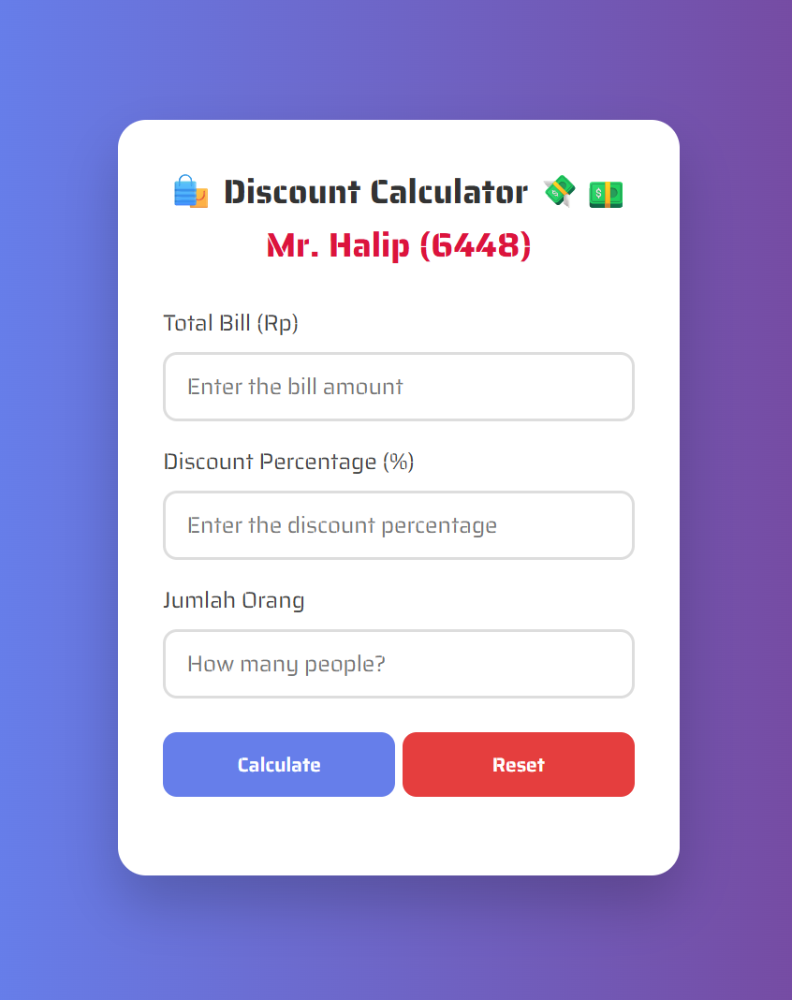

# 🛍️ Discount Calculator

A stylish and responsive **Discount Calculator** built using HTML, CSS, and JavaScript, localized for **Indonesian (Rupiah)** currency and optimized for mobile and tablet screens.

## 📱 Features

- 💸 Calculate discount from a total bill
- 👥 Split payment among multiple people
- 🇮🇩 Uses localized **Rupiah (Rp)** currency format
- 🧼 Clear/reset all fields with one click
- 🌈 Beautiful and responsive UI with smooth transitions

## 🧮 How It Works

1. Input the **bill amount** (Jumlah Tagihan)
2. Enter the **discount percentage** (Persentase Diskon)
3. Add how many **people** will split the bill
4. Click **“Hitung Diskon”** to calculate the amount each person pays
5. Use the **“Reset”** button to clear all inputs

## 🛠️ Built With

- **HTML5** — semantic structure
- **CSS3** — modern design with responsive layout
- **Vanilla JavaScript** — no frameworks required
- **Intl.NumberFormat** — for proper currency formatting in `id-ID` locale

## 📸 Preview

## 📂 Usage

Just open `index.html` in your browser. No setup needed.

## 🚀 Future Improvements

- Add **dark mode** toggle 🌙
- Save history using **localStorage**
- Add option for **PPN (tax)** calculation
- Export/share results via WhatsApp

## 📄 License

This project is licensed under the [MIT License](LICENSE) & is open-source and free to use for educational or commercial purposes.

---

Created with ❤️ by [Halip26](https://github.com/Halip26)
Created with ❤️ by [Halip26](https://github.com/Halip26)
